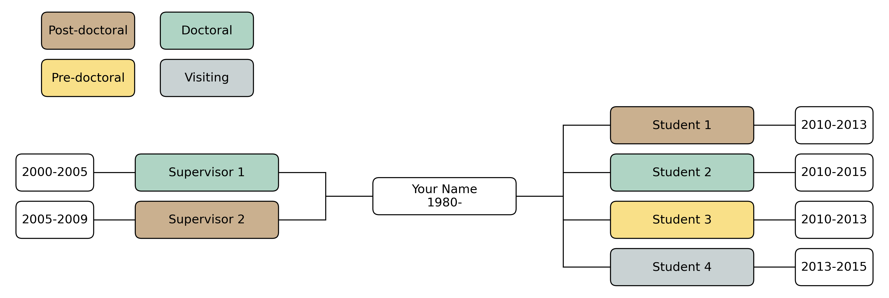

# Plant Hydraulics Family Tree Project

This project is meant to plot the family trees of researchers in Plant Hydraulics. I encourage people in this field to make a pull requests or open issues to upload or change the tree related to you.

I wrote a script to plot the family trees from CSV files. The CSV file follows a general format. For example (for better visualization, I used a table here):

| **Name**     | **Depth** | **Role**      | **Year**  |
|:-------------|:----------|:--------------|:----------|
| Your Name    | 1         | Self          | 1980-     |
| Supervisor 1 | 0         | Doctoral      | 2000-2005 |
| Supervisor 2 | 0         | Post-doctoral | 2005-2009 |
| Student 1    | 2         | Post-doctoral | 2010-2013 |
| Student 2    | 2         | Doctoral      | 2010-2015 |
| Student 3    | 2         | Pre-doctoral  | 2010-2013 |
| Student 4    | 2         | Visiting      | 2013-2015 |
|||||

For column **Depth**, 0: supervisor, 1: main character, 2: students.

For column **Role**, if depth is 0, it means the role of the main character; if depth is 2, it means the role of the person of that row.

For column **Year**, if depth is 1, it means the life time of the main character; otherwise, it means the overlapping time.

For the shown example in the table, you will get a family tree like this:

